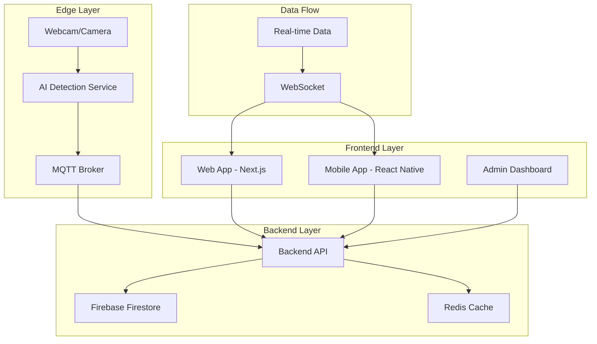

# 🚌 **TransJakarta Occupancy Management System (OMS)**

> **A complete multi-platform solution for real-time bus occupancy monitoring with AI-powered people counting and edge device integration.**

[](https://opensource.org/licenses/MIT)
[](https://www.typescriptlang.org/)
[](https://nextjs.org/)
[](https://reactnative.dev/)
[](https://firebase.google.com/)

## 🎯 **Quick Start**

### **Single Command Start (Recommended)**

| Platform | Command | Description |
|----------|---------|-------------|
| **Windows** | `.\scripts\start-all.ps1` | PowerShell script |
| **Windows** | `scripts\start-all.bat` | Command Prompt |
| **macOS/Linux** | `./scripts/start-all.sh` | Bash script |

### **Access URLs:**
- **🚌 Web Dashboard:** http://localhost:3002
- **📱 Mobile App:** http://localhost:8081
- **🔧 API:** http://localhost:3001/api/occupancy/now
- **🤖 AI Service:** http://localhost:8081/api/health

## 🏗️ **System Architecture**



## 📁 **Project Structure**

```
MPB-OMS/
├── 📱 apps/                          # Applications
│   ├── web/                          # Next.js Web App
│   ├── mobile/                       # React Native Mobile App
│   └── api/                          # Backend API Server
├── 🤖 services/                      # Microservices
│   ├── ai-modelling/                 # YOLO AI Service
│   └── edge-device/                  # Edge Device Integration
├── 📊 shared/                        # Shared Code
│   ├── types/                        # TypeScript Types
│   ├── utils/                        # Shared Utilities
│   └── config/                       # Configuration
├── 🗄️ data/                          # Data & Models
├── 🐳 infrastructure/                # Infrastructure
├── 📚 docs/                          # Documentation
├── 🧪 tests/                         # Test Suites
└── 📋 scripts/                       # Utility Scripts
```

## 🚀 **Features**

- **🌐 Web Dashboard** - Real-time bus occupancy display for operators
- **📱 Mobile App** - Cross-platform mobile application for passengers
- **🤖 AI Detection** - YOLO-based people counting with webcam integration
- **🔧 Backend API** - RESTful API with real-time WebSocket support
- **🔥 Firebase Integration** - Real-time database and authentication
- **📡 Edge Device Ready** - MQTT integration for IoT devices

## 🛠️ **Technology Stack**

### **Frontend**
- **Web**: Next.js 14, TypeScript, Tailwind CSS
- **Mobile**: React Native, Expo, TypeScript
- **UI**: Custom components, responsive design

### **Backend**
- **API**: Node.js, Express, TypeScript
- **Database**: Firebase Firestore
- **Cache**: Redis (optional)
- **Real-time**: WebSocket, MQTT

### **AI & Detection**
- **Framework**: Python, Flask
- **AI**: YOLO v8, OpenCV
- **Detection**: People counting, occupancy tracking

### **Infrastructure**
- **Deployment**: Vercel, Firebase Hosting
- **CI/CD**: GitHub Actions
- **Monitoring**: Built-in health checks

## 📚 **Documentation**

### **📖 Complete Guides**
- **[Complete System Guide](docs/COMPLETE_SYSTEM_GUIDE.md)** - Comprehensive system documentation
- **[Architecture Guide](docs/ARCHITECTURE.md)** - System design and components
- **[Project Structure](docs/PROJECT_STRUCTURE.md)** - Detailed project organization

### **🔧 Development**
- **[Development Setup](docs/DEVELOPMENT.md)** - Development environment setup
- **[API Documentation](docs/API.md)** - Complete API reference
- **[Mobile Integration](docs/MOBILE_INTEGRATION.md)** - Mobile app integration

### **🚀 Deployment**
- **[Deployment Guide](docs/DEPLOYMENT.md)** - Production deployment
- **[Quick Start](docs/QUICK_START.md)** - Quick start guide
- **[Setup Guide](docs/SETUP_GUIDE.md)** - Detailed setup instructions

## 🔄 **Data Flow**

### **Real-time Detection**
```
Webcam → AI Service → Backend API → Web/Mobile Apps
```

### **Data Storage**
```
Occupancy Data → Firebase Firestore → Real-time Updates
```

### **User Interface**
```
WebSocket → Real-time UI Updates → Live Dashboard
```

## 🧪 **Testing**

### **Run Tests**
```bash
# Backend tests
cd apps/api && npm test

# Web app tests
cd apps/web && npm test

# AI service tests
cd services/ai-modelling && python -m pytest
```

## 🐛 **Troubleshooting**

### **Common Issues**

1. **Port Already in Use**
```bash
# Check ports
netstat -ano | findstr :3001
netstat -ano | findstr :3002
netstat -ano | findstr :8081
```

2. **AI Service Not Starting**
```bash
# Check Python dependencies
pip install -r requirements.txt
# Check webcam access
python -c "import cv2; print(cv2.VideoCapture(0).isOpened())"
```

3. **Firebase Connection Issues**
```bash
# Check environment variables
echo $FIREBASE_PROJECT_ID
# Test connection
npm run test:firebase
```

## 🤝 **Contributing**

1. Fork the repository
2. Create a feature branch (`git checkout -b feature/amazing-feature`)
3. Commit your changes (`git commit -m 'Add amazing feature'`)
4. Push to the branch (`git push origin feature/amazing-feature`)
5. Open a Pull Request

## 📄 **License**

This project is licensed under the MIT License - see the [LICENSE](LICENSE) file for details.

## 🙏 **Acknowledgments**

- **TransJakarta** - For the inspiration and use case
- **YOLO** - For the computer vision capabilities
- **Firebase** - For the real-time database
- **Next.js** - For the web framework
- **React Native** - For the mobile framework

## 📞 **Support**

- **Issues**: [GitHub Issues](https://github.com/your-repo/issues)
- **Discussions**: [GitHub Discussions](https://github.com/your-repo/discussions)
- **Email**: support@transjakarta-oms.com

---

**Made with ❤️ for TransJakarta and the people of Jakarta**