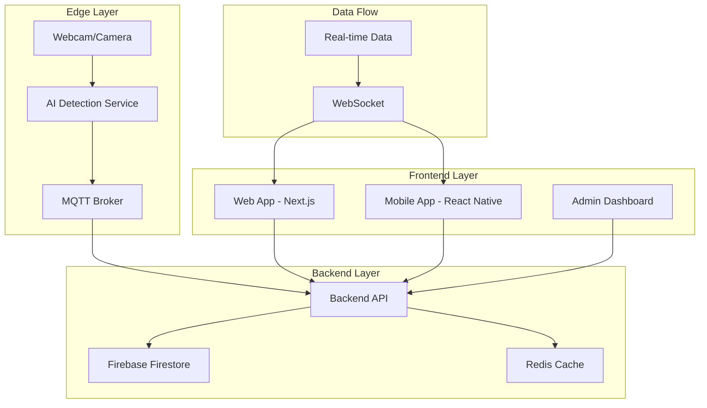

# 🏗️ **TransJakarta OMS - System Architecture**

## 📋 **Overview**

The TransJakarta Occupancy Management System (OMS) is a comprehensive multi-platform solution designed for real-time bus occupancy monitoring with AI-powered people counting and edge device integration.

## 🎯 **System Goals**

- **Real-time Monitoring**: Live occupancy data for all buses
- **AI-Powered Detection**: YOLO-based people counting
- **Multi-Platform**: Web, mobile, and edge device support
- **Scalable Architecture**: Microservices-based design
- **Single Source of Truth**: Centralized data management

## 🏗️ **High-Level Architecture**



## 🔧 **Component Architecture**

### **1. Edge Device Layer**

```
Edge Device (Raspberry Pi/Jetson)
├── Camera Input (USB/CSI)
├── AI Processing (YOLO)
├── MQTT Client
└── Local Storage
```

**Responsibilities:**
- Capture video from cameras
- Process video with AI models
- Send occupancy data via MQTT
- Handle device health monitoring

### **2. Backend API Layer**

```
Backend API (Node.js/Express)
├── REST API Endpoints
├── WebSocket Server
├── MQTT Client
├── Firebase Integration
└── Redis Cache
```

**Responsibilities:**
- Process occupancy data
- Manage real-time connections
- Handle authentication
- Provide API endpoints

### **3. Frontend Layer**

```
Web App (Next.js)
├── Real-time Dashboard
├── Admin Interface
├── Guard Interface
└── Firebase Integration

Mobile App (React Native)
├── Passenger Interface
├── Real-time Updates
├── GPS Integration
└── Offline Support
```

**Responsibilities:**
- Display occupancy data
- Handle user interactions
- Manage real-time updates
- Provide offline functionality

## 📊 **Data Architecture**

### **Data Flow**

```
Edge Device → MQTT → Backend API → Firebase → Web/Mobile Apps
     ↓           ↓         ↓           ↓
  Local AI    Real-time  Processing  Real-time
  Detection   Messaging  & Storage   Updates
```

### **Data Storage**

```
Firebase Firestore
├── Buses Collection
├── Occupancy Collection
├── Devices Collection
├── Users Collection
└── History Collection
```

### **Real-time Updates**

```
WebSocket Connection
├── Occupancy Updates
├── Device Status
├── System Alerts
└── Heartbeat
```

## 🔄 **API Architecture**

### **REST API Endpoints**

```
/api/occupancy
├── GET /now - Current occupancy
├── GET /:busId - Specific bus
└── GET /:busId/history - History

/api/devices
├── GET / - All devices
├── GET /:deviceId - Specific device
└── POST / - Register device

/api/auth
├── POST /login - User login
├── POST /logout - User logout
└── GET /me - Current user
```

### **WebSocket Events**

```
occupancy_update
├── busId: string
├── occupancy: number
├── timestamp: string
└── confidence: number

device_status
├── deviceId: string
├── status: 'online' | 'offline'
├── lastSeen: string
└── error?: string
```

## 🚀 **Deployment Architecture**

### **Development Environment**

```
Local Development
├── Frontend: localhost:3002
├── Backend: localhost:3001
├── AI Service: localhost:8081
└── Mobile: localhost:8081
```

### **Production Environment**

```
Vercel (Frontend)
├── Web App: vercel.app
├── Mobile Web: vercel.app/mobile
└── Admin: vercel.app/admin

Firebase (Backend)
├── Firestore Database
├── Authentication
├── Hosting
└── Functions
```

## 🔐 **Security Architecture**

### **Authentication Flow**

```
User Login → Firebase Auth → JWT Token → API Access
```

### **Authorization Levels**

```
Admin
├── Full system access
├── User management
└── Device management

Operator
├── Bus management
├── Occupancy monitoring
└── Device status

Guard
├── Occupancy viewing
├── Basic reporting
└── Alert management

Viewer
├── Read-only access
├── Public data
└── Basic dashboard
```

## 📈 **Scalability Architecture**

### **Horizontal Scaling**

```
Load Balancer
├── Backend API (Multiple Instances)
├── AI Service (Multiple Instances)
└── Edge Devices (Multiple Devices)
```

### **Data Partitioning**

```
Firebase Firestore
├── Buses by Route
├── Occupancy by Time
├── Devices by Location
└── Users by Role
```

## 🔍 **Monitoring Architecture**

### **Health Checks**

```
System Health
├── API Health: /health
├── Database Health: Firebase
├── AI Service Health: /api/health
└── Edge Device Health: MQTT
```

### **Metrics Collection**

```
Application Metrics
├── Response Times
├── Error Rates
├── Occupancy Accuracy
└── Device Uptime
```

## 🚨 **Error Handling Architecture**

### **Error Types**

```
System Errors
├── Network Errors
├── Database Errors
├── AI Processing Errors
└── Device Communication Errors
```

### **Error Recovery**

```
Automatic Recovery
├── Retry Mechanisms
├── Fallback Data
├── Circuit Breakers
└── Graceful Degradation
```

## 🔄 **Integration Architecture**

### **External Integrations**

```
TransJakarta Systems
├── Bus Tracking API
├── Route Information
├── Schedule Data
└── Real-time Updates
```

### **Third-party Services**

```
Firebase
├── Authentication
├── Database
├── Hosting
└── Analytics

Vercel
├── Frontend Hosting
├── Edge Functions
├── CDN
└── Analytics
```

## 📱 **Mobile Architecture**

### **React Native Structure**

```
Mobile App
├── Screens
│   ├── Home
│   ├── Bus List
│   ├── Occupancy Details
│   └── Settings
├── Components
│   ├── Bus Card
│   ├── Occupancy Indicator
│   └── Real-time Updates
├── Services
│   ├── API Client
│   ├── WebSocket
│   └── Local Storage
└── Navigation
    ├── Stack Navigator
    └── Tab Navigator
```

### **Offline Support**

```
Offline Capabilities
├── Cached Data
├── Local Storage
├── Sync on Reconnect
└── Background Updates
```

## 🌐 **Web Architecture**

### **Next.js Structure**

```
Web App
├── App Router
│   ├── Dashboard
│   ├── Admin
│   ├── Guard
│   └── Login
├── Components
│   ├── UI Components
│   ├── Business Components
│   └── Layout Components
├── Hooks
│   ├── useAuth
│   ├── useFirestore
│   └── useSocket
└── Utils
    ├── API Client
    ├── Firebase Config
    └── Helpers
```

### **Real-time Updates**

```
WebSocket Integration
├── Real-time Occupancy
├── Device Status
├── System Alerts
└── User Notifications
```

## 🔧 **Development Architecture**

### **Monorepo Structure**

```
MPB-OMS/
├── apps/
│   ├── web/ (Next.js)
│   ├── mobile/ (React Native)
│   └── api/ (Node.js)
├── services/
│   ├── ai-modelling/ (Python)
│   └── edge-device/ (Python)
├── shared/
│   ├── types/ (TypeScript)
│   ├── utils/ (TypeScript)
│   └── config/ (TypeScript)
└── infrastructure/
    ├── docker/
    ├── k8s/
    └── terraform/
```

### **Shared Code**

```
Shared Libraries
├── TypeScript Types
├── Utility Functions
├── Configuration
└── Constants
```

## 📊 **Performance Architecture**

### **Caching Strategy**

```
Multi-level Caching
├── Browser Cache (Static Assets)
├── CDN Cache (Global Content)
├── Redis Cache (API Data)
└── Local Cache (Edge Devices)
```

### **Optimization**

```
Performance Optimizations
├── Code Splitting
├── Lazy Loading
├── Image Optimization
├── Bundle Optimization
└── Database Indexing
```

## 🔄 **Data Synchronization**

### **Real-time Sync**

```
Data Synchronization
├── WebSocket Updates
├── MQTT Messages
├── Firebase Realtime
└── Conflict Resolution
```

### **Offline Sync**

```
Offline Synchronization
├── Local Storage
├── Background Sync
├── Conflict Resolution
└── Data Validation
```

## 🚀 **Future Architecture**

### **Planned Enhancements**

```
Future Features
├── Kubernetes Deployment
├── Microservices Architecture
├── Event Sourcing
├── CQRS Pattern
└── Advanced Analytics
```

### **Scalability Improvements**

```
Scalability Roadmap
├── Horizontal Scaling
├── Database Sharding
├── CDN Integration
├── Edge Computing
└── AI Model Optimization
```

---

**This architecture provides a solid foundation for the TransJakarta OMS system, ensuring scalability, maintainability, and performance while supporting real-time occupancy monitoring across multiple platforms.**
