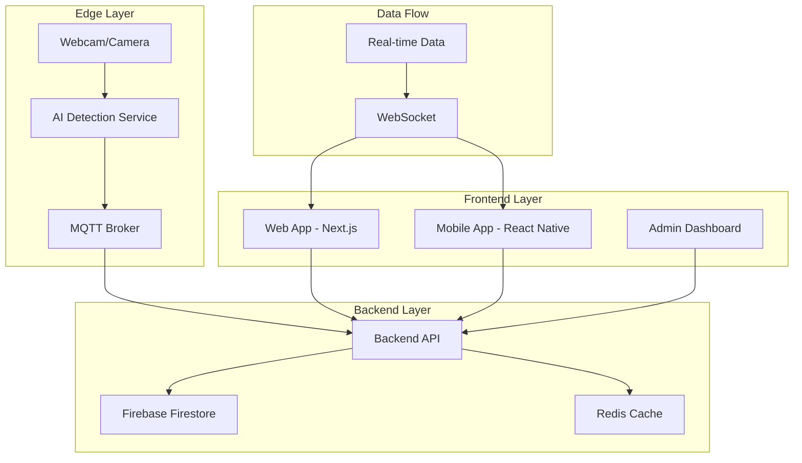

# 🚌 **TransJakarta OMS - Complete System Guide**

> **A comprehensive multi-platform solution for real-time bus occupancy monitoring with AI-powered people counting and edge device integration.**

## 📋 **Table of Contents**

1. [System Overview](#system-overview)
2. [Architecture](#architecture)
3. [Project Structure](#project-structure)
4. [Quick Start](#quick-start)
5. [Development Setup](#development-setup)
6. [API Documentation](#api-documentation)
7. [Deployment Guide](#deployment-guide)
8. [Mobile Integration](#mobile-integration)
9. [Edge Device Integration](#edge-device-integration)
10. [Troubleshooting](#troubleshooting)
11. [Contributing](#contributing)

## 🎯 **System Overview**

The TransJakarta Occupancy Management System (OMS) is a complete solution that provides:

- **🌐 Web Dashboard** - Real-time bus occupancy display for operators
- **📱 Mobile App** - Cross-platform mobile application for passengers
- **🤖 AI Detection** - YOLO-based people counting with webcam integration
- **🔧 Backend API** - RESTful API with real-time WebSocket support
- **🔥 Firebase Integration** - Real-time database and authentication
- **📡 Edge Device Ready** - MQTT integration for IoT devices

### **Key Features**

- **Real-time Monitoring**: Live occupancy data for all buses
- **AI-Powered Detection**: YOLO-based people counting
- **Multi-Platform**: Web, mobile, and edge device support
- **Scalable Architecture**: Microservices-based design
- **Single Source of Truth**: Centralized data management

## 🏗️ **Architecture**

### **High-Level Architecture**



### **Component Architecture**

```
Edge Device (Raspberry Pi/Jetson)
├── Camera Input (USB/CSI)
├── AI Processing (YOLO)
├── MQTT Client
└── Local Storage

Backend API (Node.js/Express)
├── REST API Endpoints
├── WebSocket Server
├── MQTT Client
├── Firebase Integration
└── Redis Cache

Web App (Next.js)
├── Real-time Dashboard
├── Admin Interface
├── Guard Interface
└── Firebase Integration

Mobile App (React Native)
├── Passenger Interface
├── Real-time Updates
├── GPS Integration
└── Offline Support
```

## 📁 **Project Structure**

```
MPB-OMS/
├── 📱 apps/                          # Applications
│   ├── web/                          # Next.js Web App
│   │   ├── app/                      # App Router (Next.js 13+)
│   │   ├── components/               # Reusable UI Components
│   │   ├── lib/                      # Utilities & Configurations
│   │   ├── hooks/                    # Custom React Hooks
│   │   ├── public/                   # Static Assets
│   │   ├── package.json
│   │   └── next.config.js
│   │
│   ├── mobile/                       # React Native Mobile App
│   │   ├── src/
│   │   │   ├── components/           # Mobile UI Components
│   │   │   ├── screens/              # App Screens
│   │   │   ├── services/             # API Services
│   │   │   ├── types/                # TypeScript Types
│   │   │   └── utils/                # Utilities
│   │   ├── assets/                   # Mobile Assets
│   │   ├── app.json
│   │   └── package.json
│   │
│   └── api/                          # Backend API Server
│       ├── src/
│       │   ├── routes/               # API Routes
│       │   ├── services/             # Business Logic
│       │   ├── middleware/           # Express Middleware
│       │   ├── workers/              # Background Workers
│       │   └── lib/                  # Utilities
│       ├── package.json
│       └── tsconfig.json
│
├── 🤖 services/                      # Microservices
│   ├── ai-modelling/                 # YOLO AI Service
│   │   ├── src/
│   │   │   ├── models/               # AI Models
│   │   │   ├── detection/            # Detection Logic
│   │   │   └── api/                  # Flask API
│   │   ├── requirements.txt
│   │   └── Dockerfile
│   │
│   └── edge-device/                  # Edge Device Integration
│       ├── src/
│       │   ├── camera/               # Camera Integration
│       │   ├── mqtt/                 # MQTT Client
│       │   └── detection/            # Local Detection
│       └── requirements.txt
│
├── 📊 shared/                        # Shared Code
│   ├── types/                        # TypeScript Types
│   ├── utils/                        # Shared Utilities
│   ├── constants/                    # Constants
│   └── config/                       # Configuration Files
│
├── 🗄️ data/                          # Data & Models
│   ├── models/                       # AI Models
│   ├── datasets/                     # Training Data
│   └── artifacts/                    # Generated Artifacts
│
├── 🐳 infrastructure/                # Infrastructure
│   ├── docker/                       # Docker Configurations
│   ├── k8s/                          # Kubernetes Manifests
│   ├── terraform/                    # Infrastructure as Code
│   └── scripts/                      # Deployment Scripts
│
├── 📚 docs/                          # Documentation
│   ├── api/                          # API Documentation
│   ├── deployment/                   # Deployment Guides
│   ├── development/                  # Development Guides
│   └── architecture/                 # Architecture Docs
│
├── 🧪 tests/                         # Test Suites
│   ├── unit/                         # Unit Tests
│   ├── integration/                  # Integration Tests
│   └── e2e/                          # End-to-End Tests
│
├── 📋 scripts/                       # Utility Scripts
│   ├── setup/                        # Setup Scripts
│   ├── deployment/                   # Deployment Scripts
│   └── maintenance/                  # Maintenance Scripts
│
├── 🔧 config/                        # Configuration Files
│   ├── .env.example
│   ├── docker-compose.yml
│   ├── firebase.json
│   └── vercel.json
│
└── 📄 docs/                          # Main Documentation
    ├── README.md                     # Main README
    ├── ARCHITECTURE.md               # System Architecture
    ├── API.md                        # API Documentation
    ├── DEPLOYMENT.md                 # Deployment Guide
    └── DEVELOPMENT.md                # Development Guide
```

## 🚀 **Quick Start**

### **Single Command Start (Recommended)**

| Platform | Command | Description |
|----------|---------|-------------|
| **Windows** | `.\scripts\start-all.ps1` | PowerShell script |
| **Windows** | `scripts\start-all.bat` | Command Prompt |
| **macOS/Linux** | `./scripts/start-all.sh` | Bash script |

### **What Gets Started:**
1. **🌐 Web App** (Port 3002) - Bus occupancy dashboard
2. **🔧 Backend API** (Port 3001) - REST API server
3. **🤖 AI Service** (Port 8081) - YOLO people counting
4. **📱 Mobile App** (Port 8081) - React Native web version

### **Access URLs:**
- **🚌 Web Dashboard:** http://localhost:3002
- **📱 Mobile App:** http://localhost:8081
- **🔧 API:** http://localhost:3001/api/occupancy/now
- **🤖 AI Service:** http://localhost:8081/api/health

## 🛠️ **Development Setup**

### **Prerequisites**
- **Node.js 18+** and **npm**
- **Python 3.8+** (for AI service)
- **4GB RAM** minimum (8GB recommended)
- **Webcam** (for AI detection)

### **Manual Setup**

1. **Clone Repository**
```bash
git clone <repository-url>
cd MPB-OMS
```

2. **Install Dependencies**
```bash
# Backend
cd apps/api
npm install

# Web App
cd ../web
npm install

# Mobile App
cd ../mobile
npm install

# AI Service
cd ../../services/ai-modelling
pip install -r requirements.txt
```

3. **Environment Setup**
```bash
# Copy environment files
cp .env.example .env
cp apps/api/.env.example apps/api/.env
cp apps/web/.env.example apps/web/.env
```

4. **Start Services**
```bash
# Terminal 1: Backend API
cd apps/api
npm run dev

# Terminal 2: Web App
cd apps/web
npm run dev

# Terminal 3: AI Service
cd services/ai-modelling
python app.py

# Terminal 4: Mobile App (optional)
cd apps/mobile
npm start
```

## 📊 **API Documentation**

### **Occupancy Management**
- `GET /api/occupancy/now` - Current occupancy for all buses
- `GET /api/occupancy/:busId` - Specific bus occupancy
- `GET /api/occupancy/:busId/history` - Occupancy history

### **System Status**
- `GET /health` - Health check
- `GET /api/system/status` - Detailed system status

### **AI Service**
- `GET /api/health` - AI service health
- `GET /api/occupancy` - Real-time occupancy data
- `POST /api/detect` - Trigger detection

### **Authentication**
- `POST /api/auth/login` - User login
- `POST /api/auth/logout` - User logout
- `GET /api/auth/me` - Get current user

## 🚀 **Deployment Guide**

### **Web App (Vercel)**
```bash
cd apps/web
vercel --prod
```

### **Mobile App (Expo)**
```bash
cd apps/mobile
expo build:android
expo build:ios
```

### **Backend API (Vercel)**
```bash
cd apps/api
vercel --prod
```

### **AI Service (Docker)**
```bash
cd services/ai-modelling
docker build -t tj-ai-service .
docker run -p 8081:8081 tj-ai-service
```

## 📱 **Mobile Integration**

### **React Native Structure**

```
Mobile App
├── Screens
│   ├── Home
│   ├── Bus List
│   ├── Occupancy Details
│   └── Settings
├── Components
│   ├── Bus Card
│   ├── Occupancy Indicator
│   └── Real-time Updates
├── Services
│   ├── API Client
│   ├── WebSocket
│   └── Local Storage
└── Navigation
    ├── Stack Navigator
    └── Tab Navigator
```

### **Offline Support**

```
Offline Capabilities
├── Cached Data
├── Local Storage
├── Sync on Reconnect
└── Background Updates
```

## 📡 **Edge Device Integration**

### **Edge Device Service**

```
Edge Device (Raspberry Pi/Jetson)
├── Camera Input (USB/CSI)
├── AI Processing (YOLO)
├── MQTT Client
└── Local Storage
```

### **Configuration**

```env
# MQTT Configuration
MQTT_BROKER=mqtt://localhost:1883
MQTT_USERNAME=your_username
MQTT_PASSWORD=your_password

# Camera Configuration
CAMERA_INDEX=0
CAMERA_WIDTH=640
CAMERA_HEIGHT=480
FPS=30

# AI Configuration
MODEL_PATH=./models/yolov8n.pt
CONFIDENCE_THRESHOLD=0.5
MAX_DETECTIONS=100

# Device Configuration
DEVICE_ID=edge_device_001
BUS_ID=DMR-727
LOCATION=Platform A
```

### **Data Flow**

```
Camera → AI Detection → MQTT → Backend API → Web/Mobile Apps
```

## 🔧 **Configuration**

### **Environment Variables**

#### **Backend API (.env)**
```env
PORT=3001
NODE_ENV=development
FIREBASE_PROJECT_ID=your-project-id
FIREBASE_PRIVATE_KEY=your-private-key
FIREBASE_CLIENT_EMAIL=your-client-email
CORS_ORIGIN=http://localhost:3002
```

#### **Web App (.env.local)**
```env
NEXT_PUBLIC_API_URL=http://localhost:3001
NEXT_PUBLIC_FIREBASE_PROJECT_ID=your-project-id
NEXT_PUBLIC_FIREBASE_API_KEY=your-api-key
```

#### **AI Service (.env)**
```env
FLASK_PORT=8081
MODEL_PATH=./models/yolov8n.pt
CAMERA_INDEX=0
```

## 🧪 **Testing**

### **Run Tests**
```bash
# Backend tests
cd apps/api
npm test

# Web app tests
cd apps/web
npm test

# AI service tests
cd services/ai-modelling
python -m pytest
```

### **Test Coverage**
```bash
# Generate coverage report
npm run test:coverage
```

## 📈 **Performance**

### **Expected Performance**
- **API Response**: < 100ms
- **Real-time Updates**: < 50ms
- **AI Detection**: 30 FPS
- **Concurrent Users**: 100+

### **Monitoring**
- **Health Checks**: All services
- **Metrics**: Built-in monitoring
- **Logging**: Structured logging

## 🔐 **Security**

### **Authentication**
- **JWT Tokens**: API access
- **Firebase Auth**: User management
- **CORS**: Configured origins

### **Data Protection**
- **Environment Variables**: Sensitive data
- **HTTPS**: Production deployment
- **Input Validation**: All endpoints

## 🐛 **Troubleshooting**

### **Common Issues**

1. **Port Already in Use**
```bash
# Check ports
netstat -ano | findstr :3001
netstat -ano | findstr :3002
netstat -ano | findstr :8081
```

2. **AI Service Not Starting**
```bash
# Check Python dependencies
pip install -r requirements.txt
# Check webcam access
python -c "import cv2; print(cv2.VideoCapture(0).isOpened())"
```

3. **Firebase Connection Issues**
```bash
# Check environment variables
echo $FIREBASE_PROJECT_ID
# Test connection
npm run test:firebase
```

### **Debug Mode**
```bash
# Enable debug logging
DEBUG=* npm run dev
```

## 🤝 **Contributing**

1. Fork the repository
2. Create a feature branch (`git checkout -b feature/amazing-feature`)
3. Commit your changes (`git commit -m 'Add amazing feature'`)
4. Push to the branch (`git push origin feature/amazing-feature`)
5. Open a Pull Request

## 📄 **License**

This project is licensed under the MIT License - see the [LICENSE](LICENSE) file for details.

## 🙏 **Acknowledgments**

- **TransJakarta** - For the inspiration and use case
- **YOLO** - For the computer vision capabilities
- **Firebase** - For the real-time database
- **Next.js** - For the web framework
- **React Native** - For the mobile framework

## 📞 **Support**

- **Issues**: [GitHub Issues](https://github.com/your-repo/issues)
- **Discussions**: [GitHub Discussions](https://github.com/your-repo/discussions)
- **Email**: support@transjakarta-oms.com

---

**Made with ❤️ for TransJakarta and the people of Jakarta**